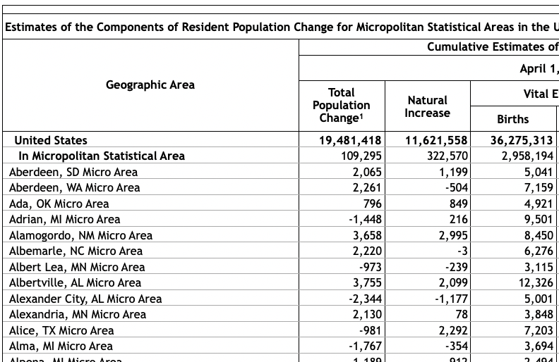
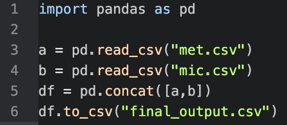
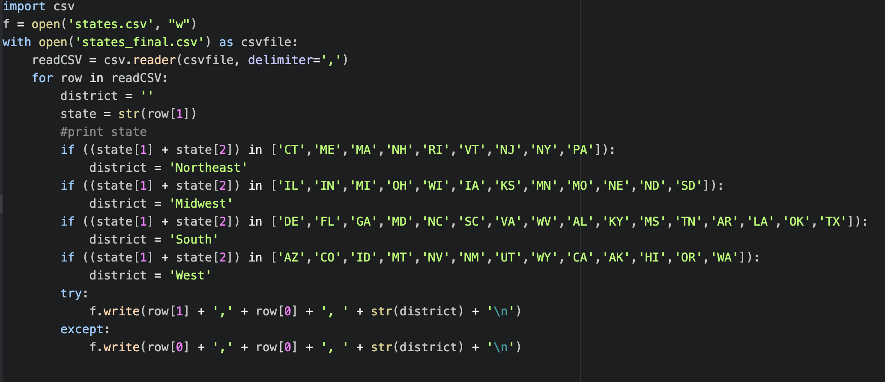

## Motivation
  
  When I started working on this section of the Portfolio Project, I began with trying to find something that I felt would be useful, interesting, and potentially make a difference. I originally settled on analyzing stock market data to answer the question of when the market would crash. This, I thought at the time, was perfect as it fulfilled all my requirements. Eventually, I went on to do peer review with my classmates and got very positive responses which boosted my confidence even more. After a while more of working however, I realized that there are other important factors in a data science project that typically go unnoticed until you're already a chunk of the way through such as scalability, data availability, and practicality of the project. 
    
  Because of this, I decided to go with a topic that I was equally interested in but that I also felt was a better fit for an assignment like this. Off of government data based off of cities, my new goal is to track the fastest growing cities and states around the United States and try to predict which cities are growing the fastest and what the major population centers will look like a decade from now. This idea is easily salable and there's a lot of data that I can add and easily, has good official sources from the government, and is personally something I find interesting that many others do too. 
  
## Initial Data Set and Making it "Tidy"

For my Data on population, the first place I looked was .gov websites, as I felt that they would provide me with good, accurate data that I could trust. Fortunately, the US Census Bureau had all the data I needed (https://www.census.gov/programs-surveys/metro-micro/data/tables.html). I downloaded two data sets of both the Metro and Micro Statistical Areas of Population Change from 2010-2019. They were both csv's and had every row filled out. Both also had around 500 rows of data, so I knew that it was enough to get my project off the ground. My first issue however, was that the sets did not have any categorical variables and that they were split into two. 

Below I included both an R view and Excel view of my original data.

```{r}
firstData <- read.csv(file = 'final_data/first.csv')
head(firstData)
```



Proceeding this, I decided it would be easier to work with if I got rid of all the current titles and gave them custom ones that I could easily remember and that would easily combine with the other csv. I did most of this in terminal and then wrote a short python script (using the pandas library) to combine the two. 



Next I had to work on getting some categorical variables. I decided the best  first variable to get would be States which meant I would have to separate the first column into two. To do this I decided to create two separate csv files (one with categorical variables and city names and the other with numbered data), manipulate them to add custom categorical variables, and then recombine them. To extract out the city data and clean it up, I ran a "grep" command on my machine and output it to a file.


When I did this command, I noticed that the first column that I extracted was already in a csv type format (and my machine read it as so). After this csv was created, all I had to do was add more categorical columns to fulfill the project's requirements. 

To achieve this, I decided to add regional values based off of more information from the US Census Bureau (https://www2.census.gov/geo/pdfs/maps-data/maps/reference/us_regdiv.pdf). I also added Political Leanings to States' Cities based off of the 2016 Election Results (https://www.270towin.com/2016_Election/). For the US row (which displays data for the country as a whole) I created a new regional value that I just called "US" and counted it as a red state because of the result of the election.

To achieve this I created two python scripts. The one for region is included below.



Following this, I added this row back to the original csv, taking out the original row. To combine columns together I needed overlapping index names, so I created python script to number each row and called it 'Index'. After this I easily combined the two and got out my final Data Set.

```{r}
finalData <- read.csv(file = 'final_data/output.csv')
head(finalData)
```

## Variable Descriptions

* Variable Names and Functions
  + City
    - The US metropolitan/politician area which the data is based off of. An area with two or more majors cities close by (Oakland/San Francisco) will be combined into the bigger of the two. 
  + State
    - The US State that the city is in. If metro is split between states, take state that has the most of its population or that the main downtown area is located in. (Categorical)
  + Region
    - The US region that the State is in based off of Census specifications. This is divided into four sub-categories (West, Midwest, South, and Northeast). (Categorical)
  + Political Leaning 
    - Which way the state sways politically (RED for more conservative politics and BLUE for liberal politics based off election results in 2016). (Categorical)
  + Population_Change_Decade
    - Total Estimated Population change over the last Decade. This includes increases/decreases due to Natural and Migration causes. (Continuous)
  + Natural_Increase_Decade
    - Estimated Population change due to Births and Deaths over the last Decade. (Continuous)
  + Births_Decade
    - Estimated Births in area over the last Decade. (Continuous)
  + Deaths_Decade
    - Estimated Deaths in area over the last Decade. (Continuous)
  + Total_Decade
    - Total Migration of those in or out of the city over the last Decade. This includes both international and domestic increase/decrease. (Continuous)
  + International_Decade
    - Estimated Increase of population from Immigrants Migrating in. (Continuous)
  + Domestic_Decade
    - Estimated Increase of population from those from other parts of the US Migrating in. (Continuous)
  + Variables with "Annual" at the end of them mean the same but using Annual Estimates (Annual data from 2018-2019)
  
## Visualizations of Data 

After finalizing my Data, the first thing I wanted to see was a comparison of what States had the highest and lowest total changes in population. This would provide me with  a good understanding of where every state lies, and create a good starting point for future observations. 

```{r}
library(ggplot2)
finalData <- read.csv(file = 'final_data/output.csv')
ggplot(finalData, aes(y=Population_Change_Decade, x=State)) +
    geom_point()
```

I realized that this function was far from complete as the outlier variable (The United States as a whole) created a much wider scale, rendering the other values as nearly unreadable. To fix this, I removed the US variable and solved scaling issues as shown in the next visual. 

```{r fig.width=12 }
suppressPackageStartupMessages(library(tidyverse)) #Imported Libary so I could filter out data
finalData %>%
    filter(State != " US") %>% #Filtered Out US outlier data to make graph more evenly scaled
ggplot(aes(State, Population_Change_Decade)) +
    geom_point() +
    theme(aspect.ratio=1/15) +
    print(labs(y="2010-2019 Population Change", x = "State")) #Used to label data in a more readable format
```

Changing my R code made it easy to read and comprehend. From the visual, I could see that states that were already large in geographical area and population tended to grow even more throughout the last decade such as Texas, Florida, and California. 

Next, I wanted to see Annual population increases between Red and Blue states. This time however, I felt that a bar graph would be more reasonable. Below is the R code created to display that. I also included color to make it more readable to the viewer.

```{r}
options(scipen=10000) #Solves the Issue of numbers being unreadable to general public
hex <- c("blue", "red") #Sets colors so graph is easier to read
bin <- c(1,2)
finalData %>%
    filter(Political_Leaning != " ") %>% #Take out any blank values
ggplot(aes(Political_Leaning, Population_Change_Annual)) +
    geom_bar(stat="identity", aes(fill = Political_Leaning)) +
    scale_fill_manual(values = hex) +
    print(labs(y="2018-2019 Population Change", x = "State Political Leaning", colors = "State Political Leaning")) #Used to label data in a more readable format

```

The results of this graph show something that wasn't instantly obvious when analyzing the data by itself - that Red states are growing nearly six times faster than Blue states. This data isn't only surprising but can even potentially help predict future elections, especially on a national scale (Think of Electoral College and number of votes based off population).

I also felt that it might be interesting to look at international population changes depending on the political leaning of each state.

```{r}
options(scipen=10000) #Solves the Issue of numbers being unreadable to general public
hex <- c("blue", "red") #Sets colors so graph is easier to read
bin <- c(1,2)
finalData %>%
    filter(Political_Leaning != " ") %>% #Take out any blank values
ggplot(aes(Political_Leaning, International_Annual)) +
    geom_bar(stat="identity", aes(fill = Political_Leaning)) +
    scale_fill_manual(values = hex) +
    print(labs(y="2018-2019 Population Change in International Migrants", x = "State Political Leaning", colors = "State Political Leaning")) #Used to label data in a more readable format

```

This visualization shows a slightly closer but still one-sided change in the data. Red states are getting nearly half a million more international people moving to them than Blue. 


## Social or Ethical Implications of the Project

Just based off of my three visualizations alone, I could already see the how the power of data can affect masses. I believe this project has both the potential to help and hurt groups of people, depending on the data that I add in the future and how I display it. Hopefully however, this can be educational overall and help individuals notice how the United States is ever changing and help us see what it will look like in the future. 

Some tend to flock to cities while others hope to live in more remote areas. I would like it if my data analysis could be used to sway people in their decision-making process for issues like where exactly they may want to move in the future, start a career or family, or buy property in. Population change, for the first part of this project, was the perfect starting variable that I felt could be easily added to to get even more interesting data. In the future, I hope to add much more to this assignment, and create something that is both helpful and interesting to those reading about it. 


## Potential Future Idea's

When looking at the Data, I could tell right off the bat that there's more that I can add in the future when asking questions. Ultimately, I'm confident that predicting the major population centers in the next decade is doable and forward looking. My interest in this project has only grown since I've started working on it and in the future I hope to add more potential variables and visualizations. Some potential variables I am considering adding in future editions of this project include - 

  + Average income per city/area
  + Political leanings in specific cities as opposed to across entire states
  + Happiness levels across cities
  + Demographics of people living in each city
  + Current city populations (as opposed to just changes)
  


